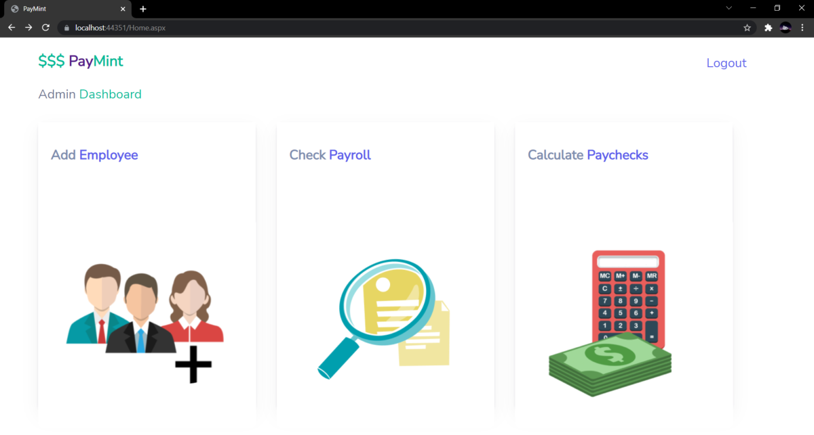
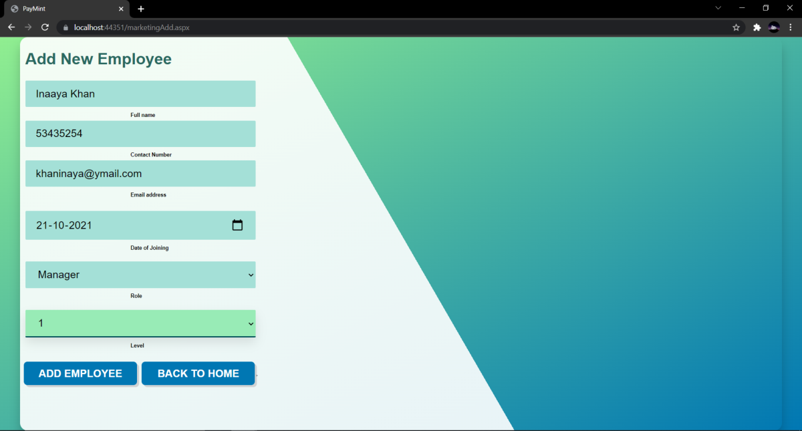
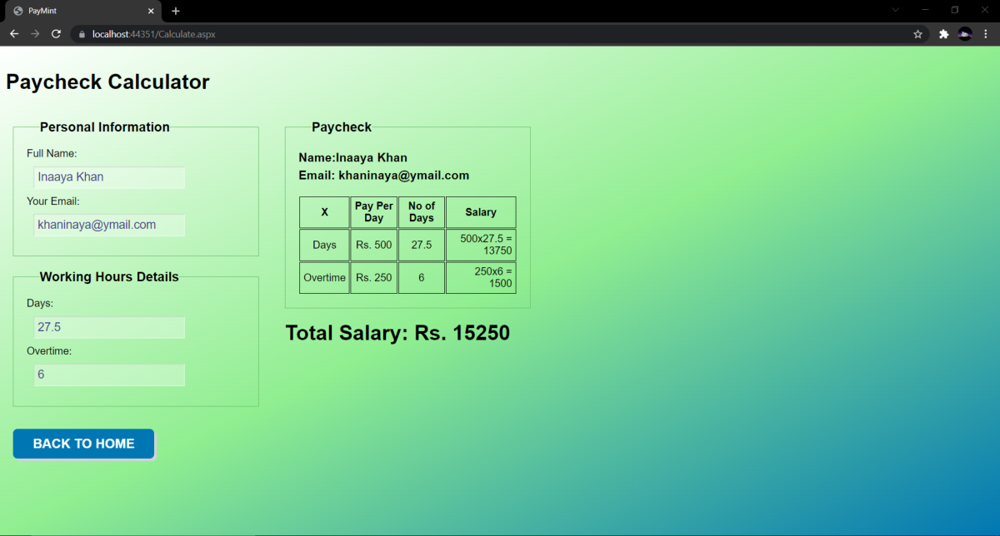

# PayMint – Payroll Management System

A web-based payroll system for adding employees to departments, viewing payroll data and calculating salaries.

**Tech:** ASP.NET Web Forms, C#, MySQL, JavaScript, CSS

**Context:** Course project at the University of Mumbai, built independently.

| Admin dashboard | Add employee | Paycheck calculator |
|---|---|---|
|  |  |  |

## Features

- Login for system users
- Adding employees to the Finance, IT and Marketing departments
- Payroll overview per department
- Paycheck calculator in JavaScript that updates the salary as working days and overtime are entered

## Setup

1. Import `paymint.sql` into a local MySQL server (creates the `paymint` database).
2. Open `FinalCry.sln` in Visual Studio.
3. Adjust the MySQL connection strings if your server or user differs from the default local setup.
4. Run the project in IIS Express.
